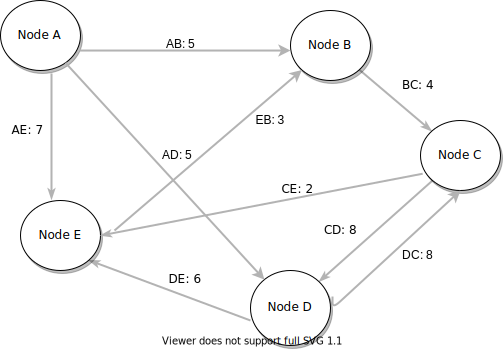

Coding challenge for Mi Bolsillo
-------
The local passenger railway serves a number of cities. For financial reasons, all train lines follow only one direction. That is a route from city X to city Y, it does not mean that there is a route from city Y to city X and even if this route exists there would be a different railway line that could have a greater distance.

The purpose of this challenge is to help the railroad provide its customers with information about the routes. In particular, you will calculate the distance along a given route, the number of different routes between two cities and the shortest route b
etween two cities.

Input
-------
A directed graph where a node represents a city and an edge represents a route between two cities. The edge weighting represents the distance between the two cities. A certain route will never appear more than once for a particular trip, the starting and ending city will not be the same city.



Output
-------
For values from 1 to 5, if there is no such route, show something like "NO SUCH ROUTE". Otherwise, follow the indicated route and do not make any extra stops! For example, the value 1 to 5 means that the trip will start in city A, then the trip will continue directly to city B (at a distance of 5), then directly to city C (at a distance of 4).

1. The distance of the route A-B-C.
2. The distance of the route A-D.
3. The distance of the route A-D-C.
4. The distance of the route A-E-B-C-D.
5. The distance of the route A-E-D.
6. The number of trips starting at C and ending at C with a maximum of 3 stops.  In the sample data below, there are two such trips: C-D-C (2 stops) and C-E-B-C (3 stops).
7. The number of trips starting at A and ending at C with exactly 4 stops.  In the sample data below, there are three such trips: A to C (via B,C,D); A to C (via D,C,D); and A to C (via D,E,B).
8. The length of the shortest route (in terms of distance to travel) from A to C.
9. The length of the shortest route (in terms of distance to travel) from B to B.
10.The number of different routes from C to C with a distance of less than 30.  In the sample data, the trips are: CDC, CEBC, CEBCDC, CDCEBC, CDEBC, CEBCEBC, CEBCEBCEBC.

Test Input
-------
For test data entry, cities are named with the first letters of the alphabet as A, B, C and D. The distance of a route between two cities (A to B) will have a distance of 5, so this value will be represented as AB5.

Test graph
-------
AB5, BC4, CD8, DC8, DE6, AD5, CE2, EB3, AE7

Output Expected
-------
* Output # 1: 9
* Output # 2: 5
* Output # 3: 13
* Output # 4: 22
* Output # 5: NO SUCH ROUTE
* Output # 6: 2
* Output # 7: 3
* Output # 8: 9
* Output # 9: 9
* Output # 10: 7

Requirements
-------
Node.js and a node global package, npm or yarn, installed in your environement.

Install
-------
```
git clone https://github.com/isabelmarh/mibolsillo-challenge.git
cd mibolsillo
```

Execute the different files in the terminal 
```
node q1-5.findDistance.js
node q6-7_tripsWithMaxStops.js
node q9_shortestPath.js
```

Acknowledgments
-------
Learning JavaScript Data Structures and Algorithms
By Loiane Groner

[Finding the Shortest Path in Javascript: Dijkstra’s Algorithm](https://levelup.gitconnected.com/finding-the-shortest-path-in-javascript-dijkstras-algorithm-8d16451eea34)
By Noam Sauer-Utley

